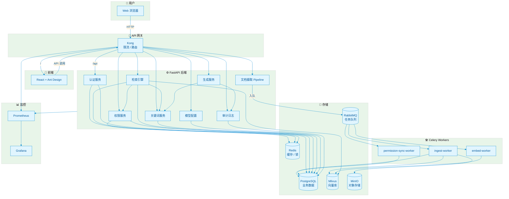

<div align="center">

<!-- 项目 Logo / 标题 -->
<h1>🏢 企业级私有化多模态 RAG 系统</h1>

<p><strong>Enterprise Private Multimodal RAG System</strong></p>

<p>
  基于五级权限穿透、上下文压缩与权限感知融合的企业知识库问答平台。<br/>
  支持文档 / Excel / 图片 / 视频 / 链接多模态 ingestion，统一 API 安全网关，蓝绿部署。
</p>

<!-- 徽章 -->
<p>
  <a href="https://github.com/renvvvvv/RFC-rag-for-company-/actions">
    
  </a>
  <a href="#">
    
  </a>
  <a href="#">
    
  </a>
  <a href="#">
    
  </a>
  <a href="#">
    
  </a>
  <a href="#">
    
  </a>
  <a href="LICENSE">
    
  </a>
</p>

<!-- 截图 / 架构图占位：后续可替换为真实系统截图 -->
<p><em>📷 可渲染架构图源码见 <a href="docs/diagrams/architecture.mmd">docs/diagrams/architecture.mmd</a></em></p>

</div>

---

## 📑 目录

- [✨ 核心特性](#-核心特性)
- [🏗️ 系统架构](#️-系统架构)
- [🚀 快速开始](#-快速开始)
  - [环境要求](#环境要求)
  - [本地启动](#本地启动)
  - [Docker 启动](#docker-启动)
- [⚙️ 配置说明](#️-配置说明)
- [📡 API 网关](#-api-网关)
- [🛡️ 权限模型](#️-权限模型)
- [🔧 部署](#-部署)
- [📊 监控与可观测性](#-监控与可观测性)
- [🤝 贡献](#-贡献)
- [📄 许可证](#-许可证)

---

## ✨ 核心特性

| 特性 | 说明 |
|------|------|
| 🧠 **多模态文档摄取** | 支持 PDF、Word、Excel、PPT、图片、视频、网页链接等多种格式 |
| 🔐 **五级权限穿透** | 文件类型 → 文档 → 字段 → 标签 → 关键词，逐层拦截 |
| 👥 **用户群权限继承** | 支持部门、角色、用户组多级权限传递 |
| 🔍 **统一检索引擎** | Milvus 向量检索 + 关键词降级 + Re-rank 重排序 |
| 🤖 **安全生成** | minimax-m3 LLM + 流式关键词拦截 + 上下文压缩 |
| 🚪 **统一 API 网关** | Kong 网关集成 rate-limiting，前后端统一入口 |
| 🎨 **管理后台** | React + Ant Design，支持知识库、上传、检索、权限、模型配置 |
| 🚀 **蓝绿部署** | GitHub Actions + Docker Compose 蓝绿发布，零停机回滚 |

---

## 🏗️ 系统架构



---

## 🚀 快速开始

### 环境要求

- Docker >= 24.0
- Docker Compose >= 2.20
- Git

### 本地启动

```bash
# 1. 克隆项目
git clone https://github.com/renvvvvv/RFC-rag-for-company-.git
cd RFC-rag-for-company-

# 2. 配置环境变量
cp backend/.env.example backend/.env
# 编辑 backend/.env，填入你的 Embedding / Re-rank / LLM 服务地址

# 3. 一键启动全栈
docker compose up -d

# 4. 查看状态
docker compose ps
```

访问地址：

| 服务 | 地址 |
|------|------|
| 🌐 前端页面 | http://localhost:3002 |
| 🚪 Kong 统一入口 | http://localhost:8000 |
| 🔧 后端 API | http://localhost:8080/api/v1 |
| 📊 Grafana | http://localhost:3001 |
| 📈 Prometheus | http://localhost:9090 |

默认账号：
- 用户名：`admin`
- 密码：`admin123`

### Docker 启动（生产推荐）

```bash
# 启动共享基础设施
docker compose -f docker-compose.infra.yml up -d

# 启动应用层（blue 或 green）
DEPLOY_COLOR=blue docker compose -f docker-compose.app.yml up -d
```

---

## ⚙️ 配置说明

在 **系统管理 → 模型配置** 中填写你的模型服务：

| 配置项 | 示例 |
|--------|------|
| Embedding URL | `http://your-embed-service:8001/embed` |
| Embedding 模型 | `bge-large-zh` / `text-embedding-3-large` |
| Re-rank URL | `http://your-rerank-service:8002/rerank` |
| Re-rank 模型 | `bge-reranker-large` |
| LLM URL | `https://api.minimax.chat/v1` |
| LLM 模型 | `minimax-m3` |
| API Key | 你的 minimax key |

> 模型配置保存后立即写入数据库并生效，无需重启后端服务。

---

## 📡 API 网关

所有 API 通过 Kong 统一入口暴露：

```bash
# 登录
curl -X POST http://localhost:8000/api/v1/auth/login \
  -d 'username=admin&password=admin123'

# 获取模型配置
curl http://localhost:8000/api/v1/config/models \
  -H "Authorization: Bearer <token>"

# 健康检查
curl http://localhost:8000/api/v1/health
```

完整 API 文档：
- Swagger UI：`http://localhost:8000/docs`
- OpenAPI JSON：`http://localhost:8000/openapi.json`

---

## 🛡️ 权限模型

系统实现五级权限穿透：

```
L0 文件类型权限
  ↓
L1 文档权限
  ↓
L2 字段权限
  ↓
L3 标签权限
  ↓
L4 关键词权限（敏感词分级）
```

- 用户群支持层级继承
- 关键词标注使用 AC 自动机，高效匹配
- 低于权限级别的内容自动脱敏或拦截

---

## 🔧 部署

### 蓝绿部署

服务器上存在两个独立目录：

```text
/opt/rag-system              # 基础设施 + 活跃颜色标记
/opt/rag-system-blue         # 蓝色应用副本
/opt/rag-system-green        # 绿色应用副本
```

CI/CD 自动部署到 inactive 颜色，健康检查通过后切换流量。

手动切换：

```bash
cd /opt/rag-system
bash scripts/blue-green-deploy.sh green
```

手动回滚：

```bash
cd /opt/rag-system
bash scripts/rollback.sh
```

### CI/CD 配置

1. Fork 本仓库
2. 在 GitHub Secrets 中配置：
   - `REGISTRY_USERNAME` / `REGISTRY_PASSWORD`
   - `BACKEND_IMAGE` / `FRONTEND_IMAGE`
   - `SSH_HOST` / `SSH_USERNAME` / `SSH_PRIVATE_KEY`
   - `DEPLOY_PATH`
3. push 到 `main` 分支即可触发自动构建与蓝绿部署

详细配置见：[docs/CI_CD_SETUP.md](docs/CI_CD_SETUP.md)

---

## 📊 监控与可观测性

项目内置 Prometheus + Grafana 监控栈：

| 指标 | 说明 |
|------|------|
| 应用健康状态 | `/api/v1/health` 可用性 |
| 容器资源 | CPU / 内存 / 网络 |
| API 请求 | Kong / FastAPI 请求量与延迟 |
| 模型调用 | Embedding / Re-rank / LLM 失败率 |

预置 Dashboard 位于 `monitoring/grafana/dashboards/`。

---

## 🤝 贡献

欢迎提交 Issue 和 Pull Request！

1. Fork 本仓库
2. 创建你的特性分支：`git checkout -b feature/xxx`
3. 提交改动：`git commit -m 'feat: add xxx'`
4. 推送分支：`git push origin feature/xxx`
5. 提交 Pull Request

---

## 📄 许可证

本项目基于 [MIT](LICENSE) 许可证开源。

---

<div align="center">

**Made with ❤️ for Enterprise AI**

</div>
