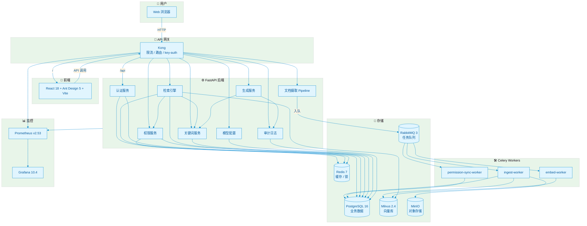

<div align="center">

<!-- 项目 Logo / 标题 -->
<h1>🏢 企业级私有化多模态 RAG 系统</h1>

<p><strong>Enterprise Private Multimodal RAG System</strong></p>

<p>
  基于五级权限穿透、上下文压缩与权限感知融合的企业知识库问答平台。<br/>
  支持文档 / Excel / 图片 / 视频 / 链接多模态 ingestion，统一 API 安全网关，蓝绿部署与 Kubernetes Helm Chart 部署。
</p>

<!-- 徽章 -->
<p>
  <a href="https://github.com/renvvvvv/RFC-rag-for-company-/actions">
    
  </a>
  <a href="#">
    
  </a>
  <a href="#">
    
  </a>
  <a href="#">
    
  </a>
  <a href="#">
    
  </a>
  <a href="#">
    
  </a>
  <a href="#">
    
  </a>
  <a href="#">
    
  </a>
  <a href="LICENSE">
    
  </a>
</p>

<!-- 架构图占位 -->
<p>
  
  <br/>
  <em>📷 可渲染架构图源码见 <a href="docs/diagrams/architecture.mmd">docs/diagrams/architecture.mmd</a></em>
</p>

</div>

---

## 📑 目录

- [✨ 核心特性](#-核心特性)
- [🏗️ 系统架构](#️-系统架构)
- [🚀 快速开始](#-快速开始)
  - [环境要求](#环境要求)
  - [Docker Compose 一键启动](#docker-compose-一键启动)
  - [Kubernetes Helm Chart 部署](#kubernetes-helm-chart-部署)
- [⚠️ 安全提示](#️-安全提示)
- [⚙️ 配置说明](#️-配置说明)
- [📡 API 网关](#-api-网关)
- [🛡️ 权限模型](#️-权限模型)
- [🔧 部署方式](#-部署方式)
- [🛡️ 安全扫描](#️-安全扫描)
- [📊 监控与可观测性](#-监控与可观测性)
- [🤝 贡献](#-贡献)
- [📄 许可证](#-许可证)

---

## ✨ 核心特性

| 特性 | 说明 |
|------|------|
| 🧠 **多模态文档摄取** | 支持 PDF、Word、Excel、PPT、图片、视频、网页链接等多种格式 |
| 🔐 **五级权限穿透** | 文件类型 → 文档 → 字段 → 标签 → 关键词，逐层拦截 |
| 👥 **用户群权限继承** | 支持部门、角色、用户组多级权限传递 |
| 🔍 **统一检索引擎** | Milvus 向量检索 + 关键词降级 + Re-rank 重排序 |
| 🤖 **安全生成** | 外部 LLM / 本地 mock LLM + 流式关键词拦截 + 上下文压缩 |
| 🚪 **统一 API 网关** | Kong 网关集成 rate-limiting 与 key-auth，前后端统一入口 |
| 🎨 **管理后台** | React 18 + Ant Design 5 + Vite，支持知识库、上传、检索、权限、模型配置 |
| 🚀 **多种部署方式** | Docker Compose 全量/轻量双模式、蓝绿部署、Kubernetes Helm Chart 生产部署 |
| 📊 **可观测性** | Prometheus + Grafana + Alertmanager 预置 Dashboard 与告警规则 |

### 界面预览

| 登录页 | 知识库搜索 | 模型配置 |
|--------|------------|----------|
|  |  |  |

---

## 🏗️ 系统架构



### RAG 检索与生成流程


### 上下文压缩流程


---

## 🚀 快速开始

### 环境要求

| 部署方式 | 要求 |
|----------|------|
| Docker Compose | Docker >= 24.0，Docker Compose >= 2.20 |
| Kubernetes | K8s >= 1.25，Helm >= 3.12，kubectl 已配置 |

### Docker Compose 一键启动

适合本地开发、功能验证与 POC：

```bash
# 1. 克隆项目
git clone https://github.com/renvvvvv/RFC-rag-for-company-.git
cd RFC-rag-for-company-

# 2. 配置环境变量
cp .env.example .env
cp backend/.env.example backend/.env
# 编辑 .env 和 backend/.env，替换默认密码，填入 Embedding / Re-rank / LLM 服务地址

# 3. 一键启动全栈
docker compose up -d

# 4. 查看状态
docker compose ps
```

访问地址：

| 服务 | 地址 |
|------|------|
| 🌐 前端页面 | http://localhost:3002 |
| 🚪 Kong 统一入口 | http://localhost:8000 |
| 🔧 后端 API | http://localhost:8080/api/v1 |
| 📊 Grafana | http://localhost:3001 |
| 📈 Prometheus | http://localhost:9090 |

> **账号说明**：系统未预置默认登录账号，首次使用请调用 `/api/v1/auth/register` 注册账号（用户名需与 `backend/.env` 中 `ADMIN_USERNAMES` 一致才能获得管理员权限）。Grafana 默认账号为 `admin` / `admin`，首次登录后请立即修改。

### Docker Compose 轻量启动（推荐本地开发 / 低配机器）

全量模式包含 Milvus、MinIO、RabbitMQ、Kong、监控等 17 个容器，对机器资源要求较高。若仅需本地开发或机器配置有限，可使用 **轻量模式**：

```bash
# 使用 PostgreSQL + pgvector 作为向量库，本地文件系统作为对象存储，Redis 作为 Celery broker
# 仅启动 5 个容器：postgres、redis、backend、worker、frontend
docker compose -f docker-compose.lightweight.yml up -d
```

轻量模式特点：

- 向量库：PostgreSQL + pgvector（替代 Milvus）
- 对象存储：本地文件系统（替代 MinIO/S3）
- 消息队列：Redis（替代 RabbitMQ）
- 容器数：5 个（全量模式约 17 个）
- 内存占用：约 1.5–2 GB（全量模式约 10 GB+）
- 适用场景：本地开发、功能验证、POC、<10 万文档的中小规模部署

> 详细对比与影响评估见 [`docs/operations/lightweight_vs_full_deployment_plan.md`](docs/operations/lightweight_vs_full_deployment_plan.md) 与 [`docs/operations/rag_quality_impact_assessment.md`](docs/operations/rag_quality_impact_assessment.md)。

### Kubernetes Helm Chart 部署

适合生产环境，支持 HPA、Ingress、外部依赖切换与 secret 管理：

```bash
# 1. 生成 secrets.yaml（从 backend/.env 自动转换）
bash k8s/helm/rag-system/generate-secrets.sh

# 2. 安装 / 升级 Chart
cd k8s/helm/rag-system
bash upgrade.sh rag-system rag-system

# 3. 查看状态
kubectl get pods -n rag-system
kubectl get svc -n rag-system
```

无 Ingress 时使用端口转发访问：

```bash
kubectl port-forward svc/rag-system-kong 8000:8000 -n rag-system
kubectl port-forward svc/rag-system-grafana 3001:3000 -n rag-system
```

完整参数与生产建议见：[`k8s/helm/rag-system/README.md`](k8s/helm/rag-system/README.md)

---

## ⚠️ 安全提示

> 🚨 **部署前请务必执行以下安全操作**：
>
> 1. **替换所有默认密码与密钥**：`JWT_SECRET_KEY`、PostgreSQL / Redis / RabbitMQ / MinIO / Grafana 密码等。
> 2. **不要在 Git 中提交敏感文件**：`.env`、`backend/.env`、`k8s/helm/rag-system/secrets.yaml` 包含密码与 API Key，请确保未误提交到版本控制（`secrets.yaml` 已加入 `.gitignore`）。
> 3. **生产环境使用外部托管服务**：建议使用 RDS / Cloud SQL、ElastiCache、CloudAMQP、S3 / MinIO 集群、Milvus 集群替代 Chart 内置有状态服务。
> 4. **限制管理面暴露**：Grafana、Prometheus、Kong Admin API 不要直接暴露公网，建议通过白名单或 VPN 访问。
> 5. **启用 TLS**：生产环境通过 Ingress + cert-manager 配置 HTTPS。
>
> 生成强密钥示例：`openssl rand -hex 32`

---

## ⚙️ 配置说明

在 **系统管理 → 模型配置** 中填写你的模型服务：

| 配置项 | 示例 |
|--------|------|
| Embedding URL | `http://your-embed-service:8001/embed` |
| Embedding 模型 | `bge-large-zh` / `text-embedding-3-large` |
| Re-rank URL | `http://your-rerank-service:8002/rerank` |
| Re-rank 模型 | `bge-reranker-large` |
| LLM URL | `https://api.minimax.chat/v1` |
| LLM 模型 | `minimax-m3` |
| API Key | 你的 LLM 服务 key |

> 模型配置保存后立即写入数据库并生效，无需重启后端服务。本地启动时也可以使用项目内置的 mock embedding / LLM 服务进行快速验证。


---

## 📡 API 网关

所有 API 通过 Kong 统一入口暴露：

```bash
# 注册账号
curl -X POST http://localhost:8000/api/v1/auth/register \
  -H "Content-Type: application/json" \
  -d '{"username":"admin","password":"your-strong-password"}'

# 登录
curl -X POST http://localhost:8000/api/v1/auth/login \
  -H "Content-Type: application/x-www-form-urlencoded" \
  -d 'username=admin&password=your-strong-password'

# 获取模型配置
curl http://localhost:8000/api/v1/config/models \
  -H "Authorization: Bearer <token>"

# 健康检查
curl http://localhost:8000/api/v1/health
```

完整 API 文档：

- Swagger UI：`http://localhost:8000/docs`
- OpenAPI JSON：`http://localhost:8000/openapi.json`

> 部分接口需要在请求头中携带 Kong key-auth key：`apikey: placeholder-api-key`（生产环境请替换）。

---

## 🛡️ 权限模型

系统实现五级权限穿透：

```
L0 文件类型权限
  ↓
L1 文档权限
  ↓
L2 字段权限
  ↓
L3 标签权限
  ↓
L4 关键词权限（敏感词分级）
```

- 用户群支持层级继承
- 关键词标注使用 AC 自动机，高效匹配
- 低于权限级别的内容自动脱敏或拦截


---

## 🔧 部署方式

### 方式一：Docker Compose 全量启动

```bash
docker compose up -d
```

### 方式二：Docker Compose 轻量启动

```bash
docker compose -f docker-compose.lightweight.yml up -d
```

### 方式三：Docker Compose 蓝绿部署

服务器上存在两个独立目录，共享基础设施，应用层双活切换：

```text
/opt/rag-system              # 基础设施 + 活跃颜色标记
/opt/rag-system-blue         # 蓝色应用副本
/opt/rag-system-green        # 绿色应用副本
```

```bash
# 启动共享基础设施
cd /opt/rag-system
docker compose -f docker-compose.infra.yml up -d

# 启动应用层（blue 或 green）
DEPLOY_COLOR=blue docker compose -f docker-compose.app.yml up -d

# 手动切换颜色
bash scripts/blue-green-deploy.sh green

# 手动回滚
bash scripts/rollback.sh
```

详细端口与 CI/CD 配置见：[`docs/CI_CD_SETUP.md`](docs/CI_CD_SETUP.md)

### 方式四：Kubernetes Helm Chart 部署（推荐生产）

```bash
cd k8s/helm/rag-system
bash upgrade.sh rag-system rag-system
```

生产环境建议：

- 关闭内置有状态服务，接入外部高可用中间件
- 配置 Ingress + TLS
- 为 `embed-worker` 配置 GPU nodeSelector / tolerations
- 启用 HPA 与持久化 StorageClass

完整指南见：[`k8s/helm/rag-system/README.md`](k8s/helm/rag-system/README.md)

---

## 🛡️ 安全扫描

CI/CD 流水线内置 DevSecOps 安全检查，覆盖 SAST、SCA、DAST、容器镜像扫描、SBOM 生成及提示词注入回归测试。

### 扫描工具与阈值

| 类型 | 工具 | 作用域 | 默认阈值 / 行为 |
|------|------|--------|----------------|
| SAST | **Ruff** | Python 后端 | 检出即失败 |
| SAST | **Bandit** | Python 后端 | 中危及以上 / 中等信心度即失败 |
| SAST | **Semgrep** | `backend/` | 发现即失败 |
| SAST | **CodeQL** | Python + JavaScript | `security-extended` 规则集 |
| SCA | **pip-audit** | `backend/requirements.txt` | 发现依赖漏洞即失败 |
| SCA | **Snyk** | `backend/requirements.txt` | 可选，需配置 `SNYK_TOKEN` |
| SCA / Secret / Misconfig | **Trivy** | 全仓库文件系统 | `HIGH/CRITICAL`，非阻塞 |
| 镜像扫描 | **Trivy** | 构建后的后端/前端镜像 | `HIGH/CRITICAL`，默认非阻塞 |
| Secret | **TruffleHog** | 全仓库 | 仅报告已验证的泄露 |
| DAST | **OWASP ZAP** | staging 站点 | 可选，需配置 `STAGING_URL` |
| 提示词注入 | **自定义 Pytest** | `backend/tests/test_prompt_injection.py` | 发现注入模式即失败 |
| SBOM | **Trivy** | 全仓库 | 生成 CycloneDX 格式 `sbom.json` |

### 配置文件

| 文件 | 说明 |
|------|------|
| [`bandit.yaml`](bandit.yaml) | Bandit 扫描范围与排除目录 |
| [`trivy.yaml`](trivy.yaml) | Trivy 严重级别、忽略文件、扫描器类型 |
| [`.trivyignore`](.trivyignore) | 已评审的可接受风险 CVE 列表 |
| [`.semgrepignore`](.semgrepignore) | Semgrep 忽略目录 |

### 报告位置

所有报告均以 GitHub Actions **Artifacts** 形式保留 30 天，并生成 `security-summary.md` 汇总。Trivy SARIF 结果会自动上传到 **GitHub Security → Code scanning alerts**。

---

## 📊 监控与可观测性

项目内置 Prometheus + Grafana + Alertmanager 监控栈。

### 访问地址

| 服务 | 地址 | 说明 |
|------|------|------|
| Grafana | http://localhost:3001 | 默认账号 `admin` / `admin` |
| Prometheus | http://localhost:9090 | 指标查询与告警状态 |
| Alertmanager | http://localhost:9093 | 告警路由与静默 |

### 预置 Dashboard

| Dashboard | UID | 说明 |
|-----------|-----|------|
| RAG System Overview | `rag-overview` | 服务健康、CPU / 内存 / 磁盘 / 网络 |
| RAG API | `rag-api` | API QPS、延迟分位值、错误率、权限拦截 |
| RAG Retrieval | `rag-retrieval` | 检索延迟、Milvus 指标、Celery 队列长度 |
| RAG LLM | `rag-llm` | 模型调用延迟、失败率、调用量 |

Dashboard 通过 `monitoring/grafana/dashboards/dashboard.yml` 自动 provision，启动后直接可用。

### 应用指标

后端已内置 `prometheus-client` 指标：

| 指标 | 类型 | 标签 | 说明 |
|------|------|------|------|
| `rag_api_requests_total` | Counter | `method`, `endpoint`, `status` | API 请求总量 |
| `rag_api_request_duration_seconds` | Histogram | `method`, `endpoint` | API 请求耗时 |
| `rag_retrieval_duration_seconds` | Histogram | `mode` | 检索耗时（hybrid / semantic / keyword） |
| `rag_generation_duration_seconds` | Histogram | `model`, `status` | LLM 生成耗时 |
| `rag_permission_intercepts_total` | Counter | `reason` | 权限/安全拦截次数 |

### 告警规则

`monitoring/prometheus/alerts.yml` 已配置以下告警：

| 告警 | 条件 | 严重级别 |
|------|------|----------|
| `RAGAPIP99LatencyHigh` | API P99 延迟 > 2s | warning |
| `RAGAPIErrorRateHigh` | API 错误率 > 1% | critical |
| `RAGRetrievalLatencyHigh` | 检索 P99 延迟 > 500ms | warning |
| `RAGCeleryQueueLengthHigh` | Celery 队列长度 > 100 | warning |
| `RAGPostgresConnectionsHigh` | PostgreSQL 连接数 > 80 | warning |
| `RAGDiskUsageHigh` | 磁盘使用率 > 75% | warning |
| `RAGServiceDown` | 任意 scrape target 掉线 | critical |

Alertmanager 配置位于 `monitoring/alertmanager.yml`。默认使用本机 webhook placeholder，确保 Alertmanager 能在没有真实 receiver 配置的情况下正常启动；生产环境请替换为邮件 / PagerDuty / Slack / 飞书等 receiver。

### 可选 Exporters

部分 exporter 默认不随应用一起启动。需要时：

1. 取消 `monitoring/prometheus.yml` 中对应 job 的注释
2. 带 `monitoring-exporters` profile 启动：

```bash
docker compose --profile monitoring-exporters up -d
```

| Exporter | 说明 |
|----------|------|
| `postgres-exporter` | PostgreSQL 连接、事务、慢查询等指标 |
| `redis-exporter` | Redis 内存、连接、命令统计 |
| `rabbitmq-exporter` | RabbitMQ 队列长度、连接数 |
| `node-exporter` | 宿主机 CPU / 内存 / 磁盘 / 网络 |

---

## 🤝 贡献

欢迎提交 Issue 和 Pull Request！

1. Fork 本仓库
2. 创建你的特性分支：`git checkout -b feature/xxx`
3. 提交改动：`git commit -m 'feat: add xxx'`
4. 推送分支：`git push origin feature/xxx`
5. 提交 Pull Request

---

## 📄 许可证

本项目基于 [MIT](LICENSE) 许可证开源。

---

<div align="center">

**Made with ❤️ for Enterprise AI**

</div>
