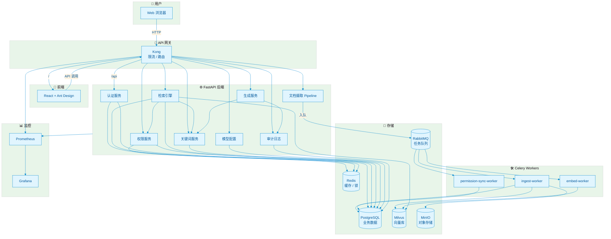

<div align="center">

<!-- 项目 Logo / 标题 -->
<h1>🏢 企业级私有化多模态 RAG 系统</h1>

<p><strong>Enterprise Private Multimodal RAG System</strong></p>

<p>
  基于五级权限穿透、上下文压缩与权限感知融合的企业知识库问答平台。<br/>
  支持文档 / Excel / 图片 / 视频 / 链接多模态 ingestion，统一 API 安全网关，蓝绿部署。
</p>

<!-- 徽章 -->
<p>
  <a href="https://github.com/renvvvvv/RFC-rag-for-company-/actions">
    
  </a>
  <a href="#">
    
  </a>
  <a href="#">
    
  </a>
  <a href="#">
    
  </a>
  <a href="#">
    
  </a>
  <a href="#">
    
  </a>
  <a href="LICENSE">
    
  </a>
</p>

<!-- 截图 / 架构图占位：后续可替换为真实系统截图 -->
<p><em>📷 可渲染架构图源码见 <a href="docs/diagrams/architecture.mmd">docs/diagrams/architecture.mmd</a></em></p>

</div>

---

## 📑 目录

- [✨ 核心特性](#-核心特性)
- [🏗️ 系统架构](#️-系统架构)
- [🚀 快速开始](#-快速开始)
  - [环境要求](#环境要求)
  - [本地启动](#本地启动)
  - [Docker 启动](#docker-启动)
- [⚙️ 配置说明](#️-配置说明)
- [📡 API 网关](#-api-网关)
- [🛡️ 权限模型](#️-权限模型)
- [🔧 部署](#-部署)
- [🛡️ 安全扫描](#️-安全扫描)
- [📊 监控与可观测性](#-监控与可观测性)
- [🤝 贡献](#-贡献)
- [📄 许可证](#-许可证)

---

## ✨ 核心特性

| 特性 | 说明 |
|------|------|
| 🧠 **多模态文档摄取** | 支持 PDF、Word、Excel、PPT、图片、视频、网页链接等多种格式 |
| 🔐 **五级权限穿透** | 文件类型 → 文档 → 字段 → 标签 → 关键词，逐层拦截 |
| 👥 **用户群权限继承** | 支持部门、角色、用户组多级权限传递 |
| 🔍 **统一检索引擎** | Milvus 向量检索 + 关键词降级 + Re-rank 重排序 |
| 🤖 **安全生成** | minimax-m3 LLM + 流式关键词拦截 + 上下文压缩 |
| 🚪 **统一 API 网关** | Kong 网关集成 rate-limiting，前后端统一入口 |
| 🎨 **管理后台** | React + Ant Design，支持知识库、上传、检索、权限、模型配置 |
| 🚀 **蓝绿部署** | GitHub Actions + Docker Compose 蓝绿发布，零停机回滚 |

### 界面预览

| 登录页 | 知识库搜索 | 模型配置 |
|--------|------------|----------|
|  |  |  |

---

## 🏗️ 系统架构




### RAG 检索与生成流程


### 上下文压缩流程


---

## 🚀 快速开始

### 环境要求

- Docker >= 24.0
- Docker Compose >= 2.20
- Git

### 本地启动

```bash
# 1. 克隆项目
git clone https://github.com/renvvvvv/RFC-rag-for-company-.git
cd RFC-rag-for-company-

# 2. 配置环境变量
cp .env.example .env
cp backend/.env.example backend/.env
# 编辑 .env 和 backend/.env，填入你的 Embedding / Re-rank / LLM 服务地址

# 3. 一键启动全栈
docker compose up -d

# 4. 查看状态
docker compose ps
```

访问地址：

| 服务 | 地址 |
|------|------|
| 🌐 前端页面 | http://localhost:3002 |
| 🚪 Kong 统一入口 | http://localhost:8000 |
| 🔧 后端 API | http://localhost:8080/api/v1 |
| 📊 Grafana | http://localhost:3001 |
| 📈 Prometheus | http://localhost:9090 |

默认账号：
- 用户名：`admin`
- 密码：`admin123`

### Docker 启动（生产推荐）

```bash
# 启动共享基础设施
docker compose -f docker-compose.infra.yml up -d

# 启动应用层（blue 或 green）
DEPLOY_COLOR=blue docker compose -f docker-compose.app.yml up -d
```

---

## ⚙️ 配置说明

在 **系统管理 → 模型配置** 中填写你的模型服务：

| 配置项 | 示例 |
|--------|------|
| Embedding URL | `http://your-embed-service:8001/embed` |
| Embedding 模型 | `bge-large-zh` / `text-embedding-3-large` |
| Re-rank URL | `http://your-rerank-service:8002/rerank` |
| Re-rank 模型 | `bge-reranker-large` |
| LLM URL | `https://api.minimax.chat/v1` |
| LLM 模型 | `minimax-m3` |
| API Key | 你的 minimax key |

> 模型配置保存后立即写入数据库并生效，无需重启后端服务。


---

## 📡 API 网关

所有 API 通过 Kong 统一入口暴露：

```bash
# 登录
curl -X POST http://localhost:8000/api/v1/auth/login \
  -d 'username=admin&password=admin123'

# 获取模型配置
curl http://localhost:8000/api/v1/config/models \
  -H "Authorization: Bearer <token>"

# 健康检查
curl http://localhost:8000/api/v1/health
```

完整 API 文档：
- Swagger UI：`http://localhost:8000/docs`
- OpenAPI JSON：`http://localhost:8000/openapi.json`

---

## 🛡️ 权限模型

系统实现五级权限穿透：

```
L0 文件类型权限
  ↓
L1 文档权限
  ↓
L2 字段权限
  ↓
L3 标签权限
  ↓
L4 关键词权限（敏感词分级）
```

- 用户群支持层级继承
- 关键词标注使用 AC 自动机，高效匹配
- 低于权限级别的内容自动脱敏或拦截


---

## 🔧 部署

### 蓝绿部署

服务器上存在两个独立目录：

```text
/opt/rag-system              # 基础设施 + 活跃颜色标记
/opt/rag-system-blue         # 蓝色应用副本
/opt/rag-system-green        # 绿色应用副本
```

CI/CD 自动部署到 inactive 颜色，健康检查通过后切换流量。


手动切换：

```bash
cd /opt/rag-system
bash scripts/blue-green-deploy.sh green
```

手动回滚：

```bash
cd /opt/rag-system
bash scripts/rollback.sh
```

### CI/CD 配置

1. Fork 本仓库
2. 在 GitHub Secrets 中配置：
   - `REGISTRY_USERNAME` / `REGISTRY_PASSWORD`
   - `BACKEND_IMAGE` / `FRONTEND_IMAGE`
   - `SSH_HOST` / `SSH_USERNAME` / `SSH_PRIVATE_KEY`
   - `DEPLOY_PATH`
3. push 到 `main` 分支即可触发自动构建与蓝绿部署

详细配置见：[docs/CI_CD_SETUP.md](docs/CI_CD_SETUP.md)

---

## 🛡️ 安全扫描

CI/CD 流水线内置 DevSecOps 安全检查，覆盖 SAST、SCA、DAST、容器镜像扫描、SBOM 生成及提示词注入回归测试。

### 扫描工具与阈值

| 类型 | 工具 | 作用域 | 默认阈值 / 行为 |
|------|------|--------|----------------|
| SAST | **Ruff** | Python 后端 | 检出即失败（`output-format=github`） |
| SAST | **Bandit** | Python 后端 | 中危及以上 / 中等信心度即失败 |
| SAST | **Semgrep** | `backend/` | `--config=auto --error`，发现即失败 |
| SAST | **CodeQL** | Python + JavaScript | 默认 `security-extended` 规则集 |
| SCA | **pip-audit** | `backend/requirements.txt` | 发现依赖漏洞即失败 |
| SCA | **Snyk** | `backend/requirements.txt` | 可选，需配置 `SNYK_TOKEN` |
| SCA / Secret / Misconfig | **Trivy** | 全仓库文件系统 | `HIGH/CRITICAL`，**非阻塞**（可配置） |
| 镜像扫描 | **Trivy** | 构建后的后端/前端镜像 | `HIGH/CRITICAL`，默认非阻塞 |
| Secret | **TruffleHog** | 全仓库 | 仅报告已验证的泄露 |
| DAST | **OWASP ZAP** |  staging 站点 | 可选，需配置 `STAGING_URL`；默认非阻塞 |
| 提示词注入 | **自定义 Pytest** | `backend/tests/test_prompt_injection.py` | 发现注入模式即失败 |
| SBOM | **Trivy** | 全仓库 | 生成 CycloneDX 格式 `sbom.json` |

### 配置文件

| 文件 | 说明 |
|------|------|
| [`bandit.yaml`](bandit.yaml) | Bandit 扫描范围与排除目录；阈值通过 CI 命令行控制 |
| [`trivy.yaml`](trivy.yaml) | Trivy 严重级别（`HIGH/CRITICAL`）、忽略文件、扫描器类型 |
| [`.trivyignore`](.trivyignore) | 已评审的可接受风险 CVE 列表 |
| [`.semgrepignore`](.semgrepignore) | Semgrep 忽略目录（`.venv`、`node_modules` 等） |

### 报告位置

所有报告均以 GitHub Actions **Artifacts** 形式保留 30 天：

| Artifact | 内容 |
|----------|------|
| `lint-test-reports` | `ruff-report.txt`、`bandit-report.json/txt`、`pytest-report.xml`、`eslint-report.txt`、`tsc-build.log` |
| `security-scan-reports` | `pip-audit-report.json`、`snyk-report.json`、`semgrep-report.json`、`trivy-fs-report.json/sarif`、`pytest-prompt-injection-report.xml`、`sbom.json` |
| `image-scan-reports` | `trivy-backend-report.json`、`trivy-frontend-report.json` |
| `dast-reports` | OWASP ZAP 扫描报告（需 `STAGING_URL`） |
| `security-reports` | `security-summary.md` 汇总上述所有报告的关键指标 |

Trivy 文件系统扫描的 SARIF 结果会自动上传到 **GitHub Security → Code scanning alerts**。

### 常用配置

- **阻断容器镜像 HIGH/CRITICAL CVE**：将仓库级变量 `IMAGE_SCAN_FAIL_ON_SEVERITY` 设为 `"true"`。
- **启用 Snyk**：在 GitHub Secrets 中设置 `SNYK_TOKEN`。
- **启用 OWASP ZAP**：在 GitHub Secrets 中设置 `STAGING_URL`。

---

## 📊 监控与可观测性

项目内置 Prometheus + Grafana + Alertmanager 监控栈。

### 访问地址

| 服务 | 地址 | 说明 |
|------|------|------|
| Grafana | http://localhost:3001 | 默认账号 `admin` / `admin` |
| Prometheus | http://localhost:9090 | 指标查询与告警状态 |
| Alertmanager | http://localhost:9093 | 告警路由与静默 |

### 预置 Dashboard

| Dashboard | UID | 说明 |
|-----------|-----|------|
| RAG System Overview | `rag-overview` | 服务健康、CPU / 内存 / 磁盘 / 网络 |
| RAG API | `rag-api` | API QPS、延迟分位值、错误率、权限拦截 |
| RAG Retrieval | `rag-retrieval` | 检索延迟、Milvus 指标、Celery 队列长度 |
| RAG LLM | `rag-llm` | 模型调用延迟、失败率、调用量（Token 成本占位） |

Dashboard 通过 `monitoring/grafana/dashboards/dashboard.yml` 自动 provision，启动后直接可用。

### 应用指标

后端已内置 `prometheus-client` 指标：

| 指标 | 类型 | 标签 | 说明 |
|------|------|------|------|
| `rag_api_requests_total` | Counter | `method`, `endpoint`, `status` | API 请求总量 |
| `rag_api_request_duration_seconds` | Histogram | `method`, `endpoint` | API 请求耗时 |
| `rag_retrieval_duration_seconds` | Histogram | `mode` | 检索耗时（hybrid / semantic / keyword） |
| `rag_generation_duration_seconds` | Histogram | `model`, `status` | LLM 生成耗时 |
| `rag_permission_intercepts_total` | Counter | `reason` | 权限/安全拦截次数 |

### 告警规则

`monitoring/prometheus/alerts.yml` 已配置以下告警：

| 告警 | 条件 | 严重级别 |
|------|------|----------|
| `RAGAPIP99LatencyHigh` | API P99 延迟 > 2s | warning |
| `RAGAPIErrorRateHigh` | API 错误率 > 1% | critical |
| `RAGRetrievalLatencyHigh` | 检索 P99 延迟 > 500ms | warning |
| `RAGCeleryQueueLengthHigh` | Celery 队列长度 > 100 | warning |
| `RAGPostgresConnectionsHigh` | PostgreSQL 连接数 > 80 | warning |
| `RAGDiskUsageHigh` | 磁盘使用率 > 75% | warning |
| `RAGServiceDown` | 任意 scrape target 掉线 | critical |

Alertmanager 配置位于 `monitoring/alertmanager.yml`。默认使用一个本机 webhook placeholder，确保 Alertmanager 能在没有真实 SMTP/PagerDuty/Slack 配置的情况下正常启动；生产环境请替换为邮件 / PagerDuty / Slack / 飞书等 receiver。

### 可选 Exporters

部分 exporter 会抓取宿主机或数据存储资源，默认不随应用一起启动，相关的 Prometheus scrape job 也已被注释掉，避免默认启动时产生大量 down target。需要时：

1. 取消 `monitoring/prometheus.yml` 中对应 job 的注释。
2. 带 `monitoring-exporters` profile 启动：

```bash
# 启动应用 + 可选 exporter
docker compose --profile monitoring-exporters up -d

# 或仅启动基础设施 + exporter
docker compose -f docker-compose.infra.yml --profile monitoring-exporters up -d
```

| Exporter | 说明 |
|----------|------|
| `postgres-exporter` | PostgreSQL 连接、事务、慢查询等指标 |
| `redis-exporter` | Redis 内存、连接、命令统计 |
| `rabbitmq-exporter` | RabbitMQ 队列长度、连接数 |
| `node-exporter` | 宿主机 CPU / 内存 / 磁盘 / 网络 |

Exporter 启动并取消注释对应 job 后，Prometheus 会自动 scrape。

---

## 🤝 贡献

欢迎提交 Issue 和 Pull Request！

1. Fork 本仓库
2. 创建你的特性分支：`git checkout -b feature/xxx`
3. 提交改动：`git commit -m 'feat: add xxx'`
4. 推送分支：`git push origin feature/xxx`
5. 提交 Pull Request

---

## 📄 许可证

本项目基于 [MIT](LICENSE) 许可证开源。

---

<div align="center">

**Made with ❤️ for Enterprise AI**

</div>
