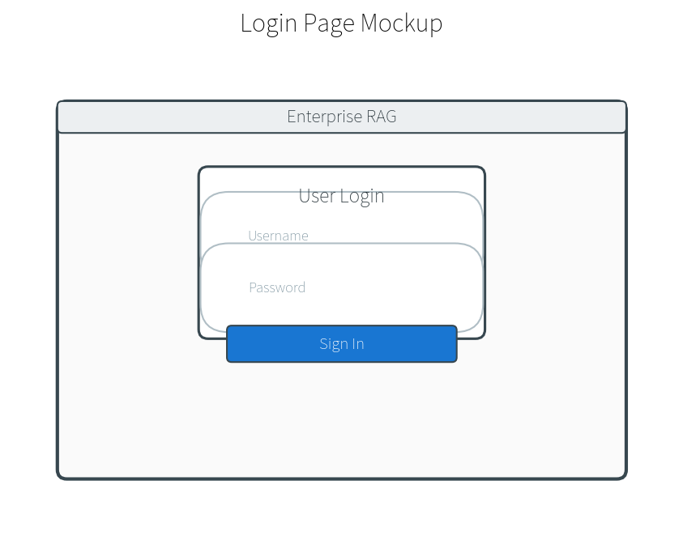
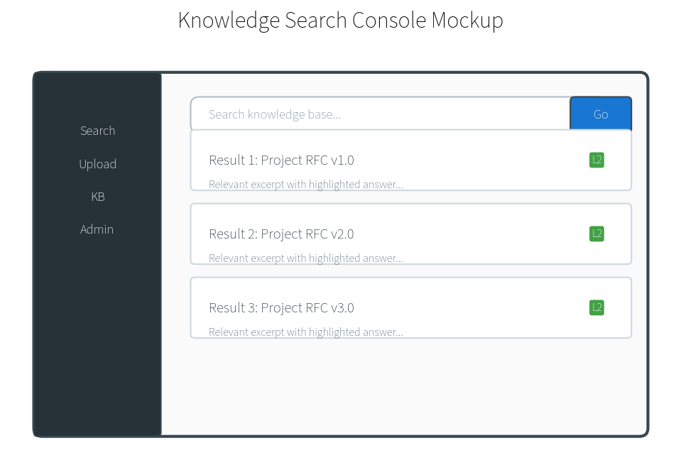
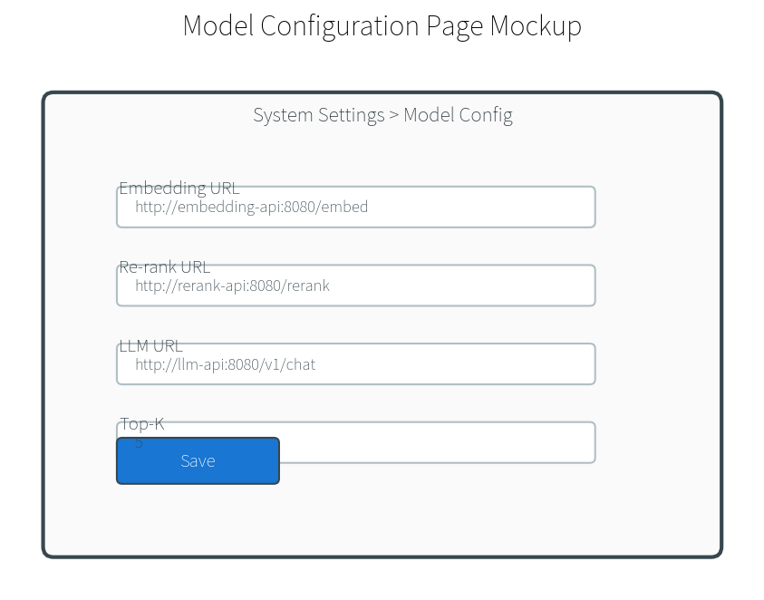
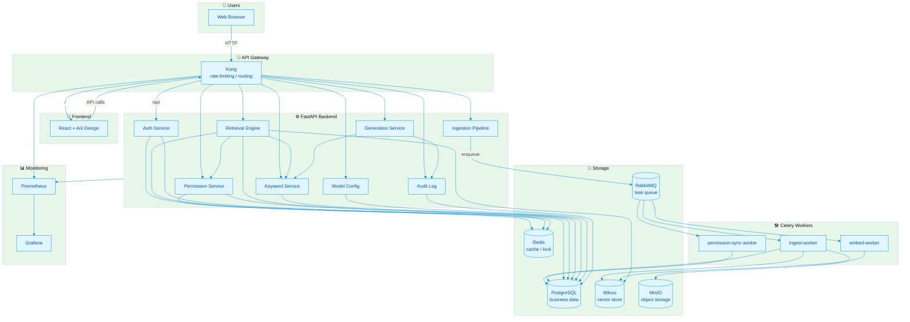
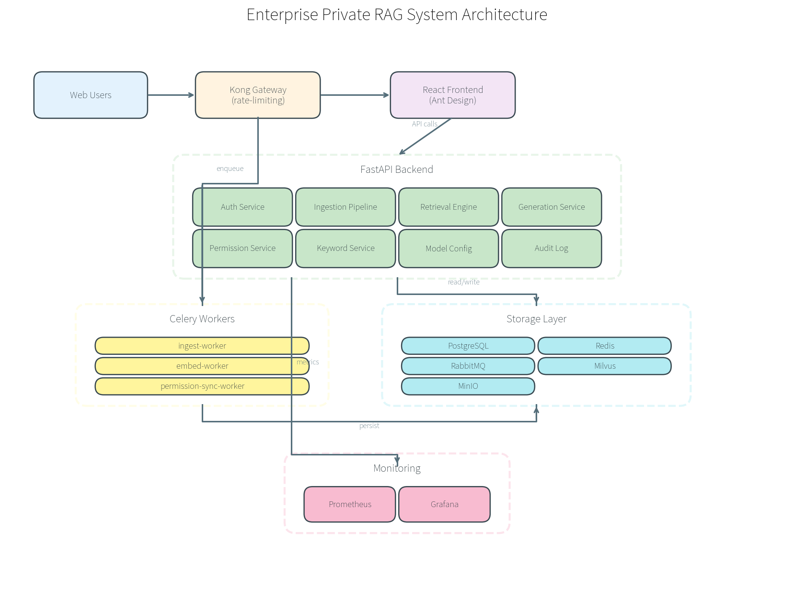
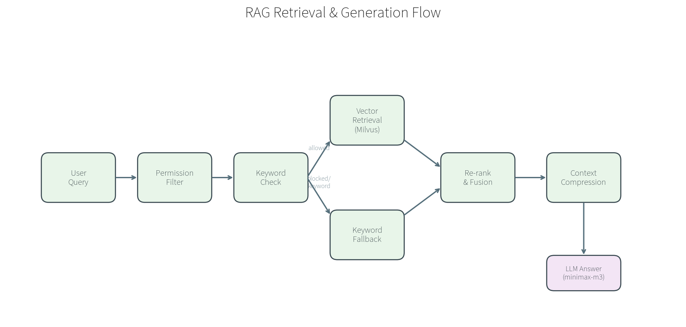
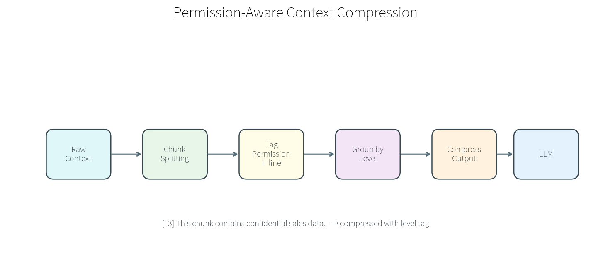
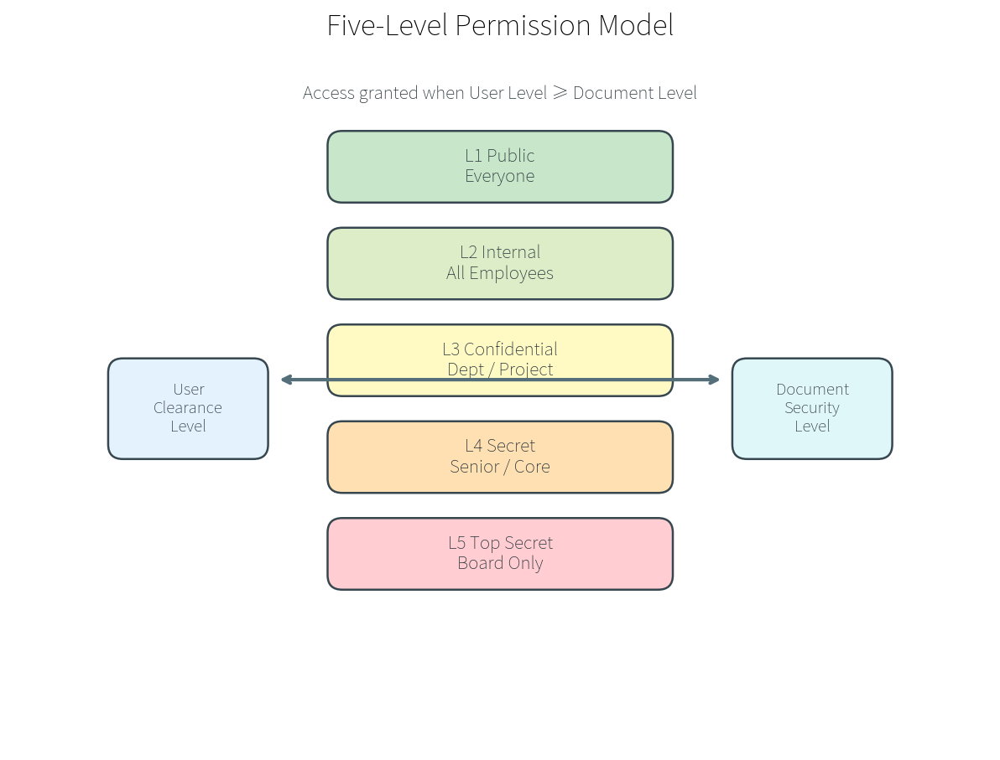
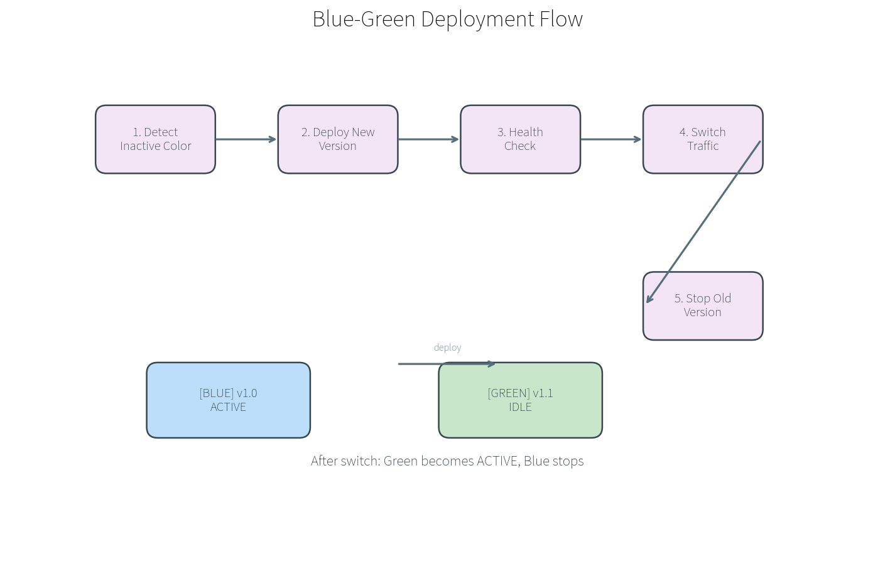

<div align="center">

<h1>🏢 Enterprise Private Multimodal RAG System</h1>

<p><strong>Private enterprise knowledge-base Q&A platform with five-level permission penetration and context-aware compression.</strong></p>

<p>
  Supports ingestion of documents, Excel, images, videos, and web links.<br/>
  Unified API security gateway, blue-green deployment, and built-in observability.
</p>

<p>
  <a href="https://github.com/renvvvvv/RFC-rag-for-company-/actions">
    
  </a>
  
  
  
  
  
  
</p>

</div>

---

## 📑 Table of Contents

- [✨ Features](#-features)
- [🏗️ Architecture](#️-architecture)
- [🚀 Quick Start](#-quick-start)
  - [Requirements](#requirements)
  - [Local Start](#local-start)
  - [Docker Start](#docker-start)
- [⚙️ Configuration](#️-configuration)
- [📡 API Gateway](#-api-gateway)
- [🛡️ Permission Model](#️-permission-model)
- [🔧 Deployment](#-deployment)
- [📊 Monitoring](#-monitoring)
- [🤝 Contributing](#-contributing)
- [📄 License](#-license)

---

## ✨ Features

| Feature | Description |
|---------|-------------|
| 🧠 **Multimodal Ingestion** | PDF, Word, Excel, PPT, images, videos, web links |
| 🔐 **Five-Level Permission Penetration** | File-type → Document → Field → Tag → Keyword |
| 👥 **User Group Inheritance** | Department, role, and group-based permission propagation |
| 🔍 **Unified Retrieval Engine** | Milvus vector search + keyword fallback + Re-rank |
| 🤖 **Secure Generation** | minimax-m3 LLM + streaming keyword interception + context compression |
| 🚪 **Unified API Gateway** | Kong with rate-limiting and single entrypoint |
| 🎨 **Admin Dashboard** | React + Ant Design for KB, upload, search, permissions, model config |
| 🚀 **Blue-Green Deployment** | GitHub Actions + Docker Compose with zero-downtime rollback |

---

### UI Preview

| Login | Knowledge Search | Model Config |
|-------|------------------|--------------|
|  |  |  |

---

## 🏗️ Architecture





### RAG Retrieval & Generation Flow



### Context Compression Flow



## 🚀 Quick Start

### Requirements

- Docker >= 24.0
- Docker Compose >= 2.20
- Git

### Local Start

```bash
# 1. Clone
git clone https://github.com/renvvvvv/RFC-rag-for-company-.git
cd RFC-rag-for-company-

# 2. Configure environment
cp backend/.env.example backend/.env
# Edit backend/.env with your Embedding / Re-rank / LLM endpoints

# 3. Start full stack
docker compose up -d

# 4. Check status
docker compose ps
```

Access points:

| Service | URL |
|---------|-----|
| 🌐 Frontend | http://localhost:3002 |
| 🚪 Kong Gateway | http://localhost:8000 |
| 🔧 Backend API | http://localhost:8080/api/v1 |
| 📊 Grafana | http://localhost:3001 |
| 📈 Prometheus | http://localhost:9090 |

Default account:
- Username: `admin`
- Password: `admin123`

### Docker Start (Production Recommended)

```bash
# Start shared infrastructure
docker compose -f docker-compose.infra.yml up -d

# Start application layer (blue or green)
DEPLOY_COLOR=blue docker compose -f docker-compose.app.yml up -d
```

---

## ⚙️ Configuration

Configure model services in **System Admin → Model Config**:

| Config | Example |
|--------|---------|
| Embedding URL | `http://your-embed-service:8001/embed` |
| Embedding Model | `bge-large-zh` / `text-embedding-3-large` |
| Re-rank URL | `http://your-rerank-service:8002/rerank` |
| Re-rank Model | `bge-reranker-large` |
| LLM URL | `https://api.minimax.chat/v1` |
| LLM Model | `minimax-m3` |
| API Key | Your minimax key |

> Model config is persisted to PostgreSQL and takes effect immediately — no restart required.


---

## 📡 API Gateway

All APIs are exposed through the Kong gateway:

```bash
# Login
curl -X POST http://localhost:8000/api/v1/auth/login \
  -d 'username=admin&password=admin123'

# Get model config
curl http://localhost:8000/api/v1/config/models \
  -H "Authorization: Bearer <token>"

# Health check
curl http://localhost:8000/api/v1/health
```

Full API docs:
- Swagger UI: `http://localhost:8000/docs`
- OpenAPI JSON: `http://localhost:8000/openapi.json`

---

## 🛡️ Permission Model

Five-level permission penetration:

```
L0 File-type permission
  ↓
L1 Document permission
  ↓
L2 Field permission
  ↓
L3 Tag permission
  ↓
L4 Keyword permission (sensitive word levels)
```

- User groups support hierarchical inheritance.
- Keywords are annotated via Aho-Corasick automaton for efficient matching.
- Content below the user's permission level is masked or intercepted.



---

## 🔧 Deployment

### Blue-Green Deployment

Two independent directories on the server:

```text
/opt/rag-system              # Infrastructure + active color marker
/opt/rag-system-blue         # Blue application copy
/opt/rag-system-green        # Green application copy
```

CI/CD deploys to the inactive color, switches traffic after health checks pass.



Manual switch:

```bash
cd /opt/rag-system
bash scripts/blue-green-deploy.sh green
```

Manual rollback:

```bash
cd /opt/rag-system
bash scripts/rollback.sh
```

### CI/CD Setup

1. Fork this repository.
2. Configure GitHub Secrets:
   - `REGISTRY_USERNAME` / `REGISTRY_PASSWORD`
   - `BACKEND_IMAGE` / `FRONTEND_IMAGE`
   - `SSH_HOST` / `SSH_USERNAME` / `SSH_PRIVATE_KEY`
   - `DEPLOY_PATH`
3. Push to `main` to trigger build and blue-green deployment.

See details: [docs/CI_CD_SETUP.md](docs/CI_CD_SETUP.md)

---

## 📊 Monitoring

Built-in Prometheus + Grafana stack:

| Metric | Description |
|--------|-------------|
| Application Health | `/api/v1/health` availability |
| Container Resources | CPU / memory / network |
| API Requests | Kong / FastAPI request volume and latency |
| Model Calls | Embedding / Re-rank / LLM failure rate |

Pre-configured dashboards are in `monitoring/grafana/dashboards/`.

---

## 🤝 Contributing

Contributions are welcome!

1. Fork the repository.
2. Create your feature branch: `git checkout -b feature/xxx`
3. Commit your changes: `git commit -m 'feat: add xxx'`
4. Push to the branch: `git push origin feature/xxx`
5. Open a Pull Request.

---

## 📄 License

This project is licensed under the [MIT](LICENSE) License.

---

<div align="center">

**Made with ❤️ for Enterprise AI**

</div>
